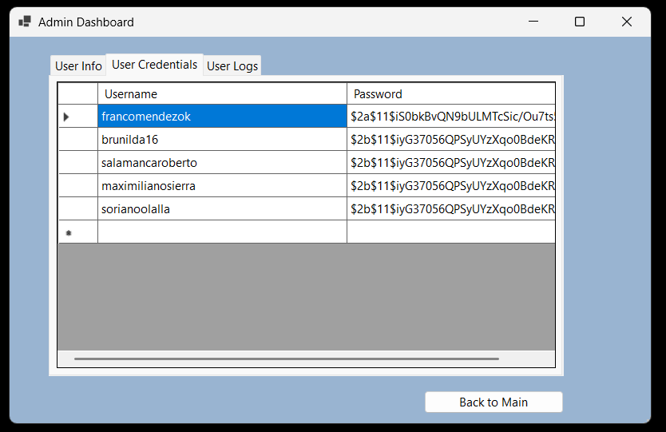

IEFI 2 Laboratorio 3
 
 
<strong>Tablas</strong>
 
 

 
 

 
 
<strong>Seleccionar archivo de base de datos access</strong>
 
 

 
 
<strong>Login</strong>
 
 

 
 
<strong>Registro de Usuario por primera vez</strong>
 
 

 
 
<strong>Interfaz Principal</strong>
 
 

 
 
<strong>Interfaz CRUD (solo para usuarios administradores)</strong>
 
 

 
 
<strong>Eliminar usuario</strong>
 
 

 
 
<strong>Editar info de usuario al modificar una celda</strong>
 
 

 
 
<strong>Dashboard Info Usuarios (solo para usuarios administradores)</strong>
 
 

 
 
<strong>Dashboard Credenciales Usuarios (solo para usuarios administradores. Contraseña encriptada por seguridad)</strong>
 
 

 
 
<strong>Dashboard Logs tiempos Usuarios (solo para usuarios administradores)</strong>
 
 

 
 
<strong>Registro de tiempo transcurrido en la base de datos</strong>
 
 

